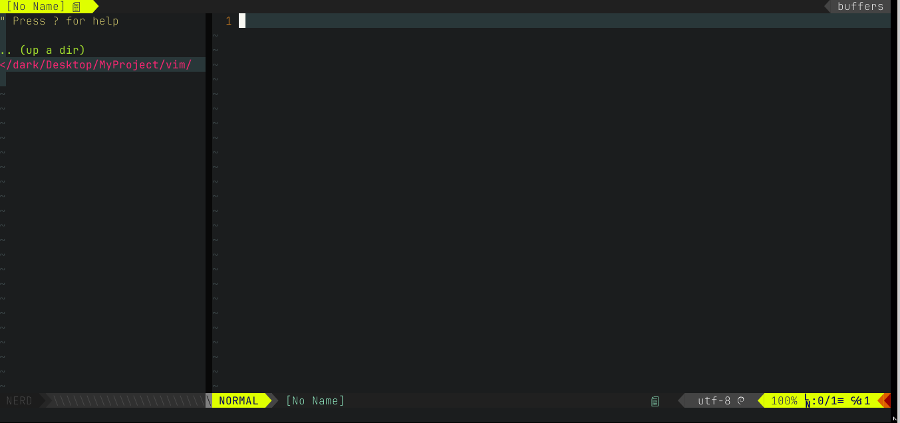
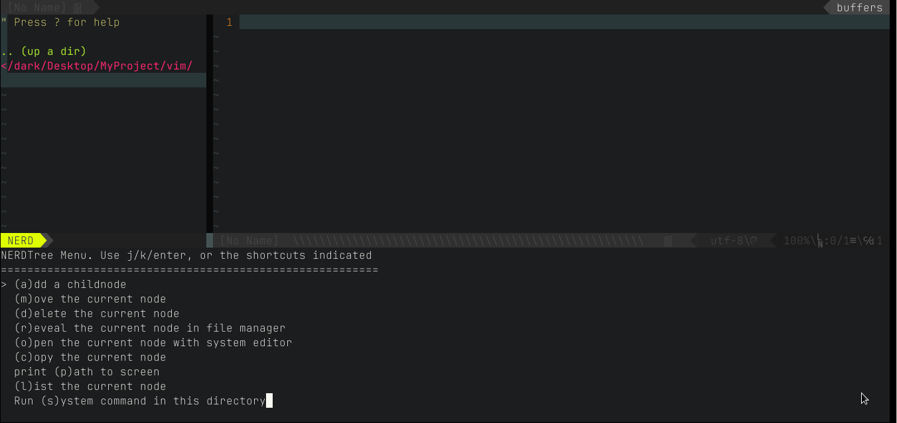
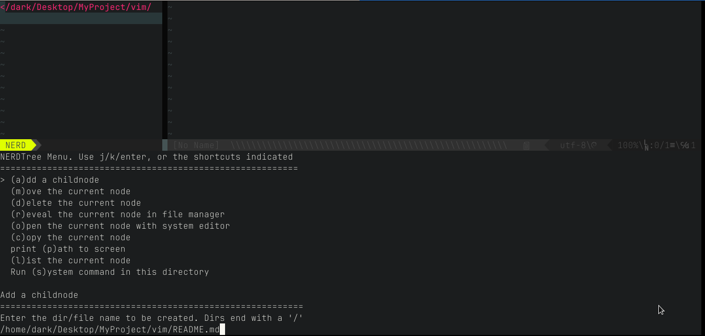
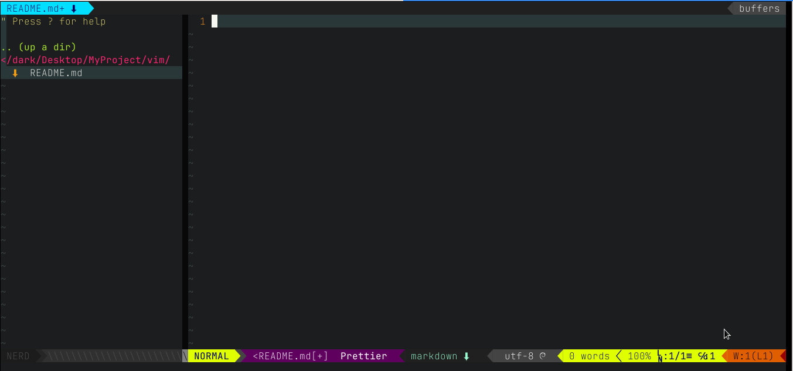
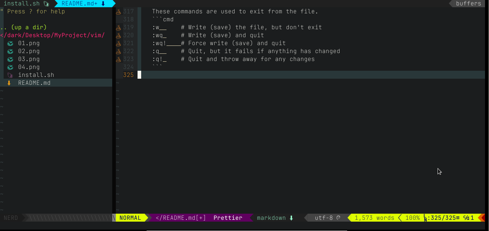

# Make VIM Look & Work like VS Code for Web Development









## Why should you use VIM instead of VSCode?

<ul>
  <li>If you haven't a lot of RAM and CPU available, Vim is a good alternative.</li>
  <li>Vim is an open-source text-editor, and also is a highly extensible editor.</li>
  <li>You can customize it by using plugins or VimScript.</li>
  <li>Vim is very light, does not lock, its startup is fast and consumes very little resources on your machine.</li>
</ul>

## Automatic Install:

Clone or download it and run the `./install.sh` script to set everything up automatically. The script may take a little bit of time so be patient.

## Manual Install Instructions:

1. Copy `.vimrc` file to your home directory (overwrite existing file you never edited it before).
2. Please wait to install plugin and after install type `:q` or press F4 to quit vim. And type `vim` in terminal again.

## The NERD Tree Menu:

<ul>
  <li>NERDTree Menu. Use j/k/enter, or the shortcuts indicated
  <li>=========================================================
  <li>> (a)dd a childnode</li>
  <li>(m)ove the current node</li>
  <li>(d)elete the current node</li>
  <li>(r)eveal the current node in file manager</li>
  <li>(o)pen the current node with system editor</li>
  <li>(c)opy the current node</li>
  <li>print (p)ath to screen</li>
  <li>(l)ist the current node</li>
</ul>

## Custom settings:

1. `Ctrl` + `B` show/hide TreeToggle in all mode.
2. `Ctrl` + `/` toggles comments in all mode.
3. `F12` show/hide to browse the tags in normal model.
4. Pressing `Shift` + `Left` and `Shift` + `Right` moves the tabs.
5. Pressing `Shift` + `H` and `Shift` + `L` moves the tabs.
6. Pressing `Shift` + `W` close the tab.
7. Pressing `Ctrl` + `Left` and `Ctrl` + `Right` moves the buffers.
8. Pressing `Ctrl` + `H` and `Ctrl` + `L` moves the buffers.
9. Pressing `Ctrl` + `W` close the buffer.
10. Pressing `Ctrl` + `F` search in current directory in normal mode.
11. Pressing `Shift` + `F` search in file content in normal mode.
12. Pressing `Ctrl` + `X` cut selected text in virtual mode.
13. Pressing `Ctrl` + `C` copy selected text in virtual mode.
14. Pressing `Ctrl` + `V` paste text in selected position in normal mode.
15. Pressing `Shift` + `Z` undo in all mode.
16. Pressing `ZZ` undo in all mode.
17. Pressing `Ctrl` + `Y` redo in all mode.
18. Pressing `Ctrl` + `S` save in all mode.
19. Pressing `Enter` auto completion.
20. `F4` exit vim.
21. `F9` show/hide termminal.
22. I set format files on save, you can change it.

## Vi/Vim-commands:

Vi editor is the most popular text editor from the early days of Unix. Whereas Vim(Vi IMproved) is an improved version of vi editor to be used in CLI (command line interface) for mainly text editing tasks in many configuration files. Some of the other alternatives are Elvis, Nvi, Nano, Joe, and Vile.
It has two main operation modes,

1.  **Command Mode:** It allows the entry of commands to manipulate text.
2.  **Entry mode(Or Insert mode):** It allows typed characters on the keyboard into the current file.

#### 1. Start with Vi Editor

You can create a new file or open an existing file using `vi filename` command.

```cmd
 vi <filename_NEW> or <filename_EXISTING> // Create a new file or open an existing file

 Example:
 vi first.txt
```

Let's see how do you create file, enter the content and leave the CLI by saving the changes.

1.  Create a new file named `first.txt`
2.  Press `i` to enter the insert mode
3.  Enter the text "Hello World!"
4.  Save the text and exit by pressing `:wq!` command
5.  Check the entered text

#### 2. Cursor movement

    These commands will be used in Command mode.

##### Move cursor

You can use arrow keys(left, right, up and down) to move the cursor on the terminal. But you can also other keys for this behavior.

```cmd
 h        # Move left
 j        # Move down
 k        # Move up
 l        # Move right
```

##### Jump one word

These commands used to jump one word at a time

```cmd
w        # Jump forwards to the start of a word
W        # Jump forwards to the start of a WORD
e        # Jump forwards to the start of a word
E        # Jump forwards to the start of a WORD
b        # Jump backwords to the start of a word
B        # Jump backwords to the start of a WORD
```

##### Jump to start or end of a line or next line

These commands used to jump starting or ending of a line or a next line.

```cmd
^        # Jump to the start of a current line
$        # Jump to the end of a current line
return   # Jump to the start of a next line
```

##### Move sides

These commands used to moves all sides of the screen

```cmd
Backspace # Move cursor one character to the left
Spacebar  # Move cursor one character to the right
H(High)   # Move cursor to the top of the screen
M(Middle) # Move cursor to the middle of the screen
L(Low)    # Move cursor to the bottom of the screen
```

##### Paging and Scrolling

Paging is used to moves the cursor up or down through the text a full screen at a time. Whereas Scrolling happens line by line.

```cmd
Ctrl + f     # move forward one full screen
Ctrl + b     # move backward one full screen
Ctrl + d     # move forward half a screen
Ctrl + u     # move backward half a screen
```

##### Inserting Text

These commands places vi in entry mode from command mode. First, you need to be in command mode to use the below commands.

###### Insert

```cmd
i    # Insert text to the left of the cursor
I    # Insert text at the beginning of a line
ESC  # Exit insert mode
```

###### Append

```cmd
a    # Insert(or Append) text to the right of the cursor
A    # Insert(or Append) text at the end of a line
```

###### Open a line

```cmd
o    # Open a line below the current cursor position
O    # open a line above the current cursor position
```

##### Editing Text

1. **Change word:** Change word/part of word to right of cursor

   ```cmd
   cw
   ```

2. **Change line** Change entire line

   ```cmd
   cc
   ```

3. **Change line from specific character** Change from cursor to end of line

   ```cmd
   C
   ```

##### Deleting Text

1. **Deleting One Character:** Position the cursor over the character to be deleted and type x

   ```cmd
   x
   X       //To delete one character before the cursor
   ```

2. **Deleting a Word:** Position the cursor at the beginning of the word and type dw

   ```cmd
   dw
   ```

3. **Deleting a Line:** Position the cursor anywhere on the line and type dd.

   ```cmd
   dd
   ```

##### Cut, Copy & Paste

Copy, Cut and Paste operations can be done in either Normal or visual Mode.

1. **Normal mode:** This mode appears on click of `Esc` key.

   **Copy** There are various copy or yank commands based on amount of text to be copied. The `y` character is used to perform this operation.

   i. Copy an entire line: Just place the cursor at the beginning of the line and type `yy`

   ```cmd
   yy
   ```

   ii.Copy three lines: Just place the cursor from where to start copying and type `3yy`

   ```cmd
   3yy
   ```

   iii. Copy word with trailing whitespace: Place the cursor at the beginning of the word and type `yaw`

   ```cmd
   yaw
   ```

   iv. Copy word without trailing whitespace: Place the cursor at the beginning of the word and type `yiw`.

   ```cmd
   yiw
   ```

   v. Copy right of the cursor: Copy text right of the cursor to the end of line using `y$` command

   ```cmd
   y$
   ```

   vi.Copy left of the cursor: Copy text left of the cursor to the end of line using `y^` command

   ```cmd
   y^
   ```

   vii. Copy text between the cursor and character: Copy text between the cursor and specified character.

   ```cmd
   ytx(Copy until x and x is excluded)
   yfx(Copy until x and x is included)
   ```

   **Cut** There are various cutting or deleting commands based on amount of text to be deleted. The `d` character is used to perform this operation.

   i. Cut entire line: Cut the entire line where the cursor is located

   ```cmd
   dd
   ```

   ii.Cut three lines: Cut the three lines starting from the place where cursor is located

   ```cmd
   3dd
   ```

   iii.Cut right of the cursor: Cut the text from the right of the cursor till the end of line

   ```cmd
   d$
   ```

   iii.Cut left of the cursor: Cut the text from the left of the cursor till the beginning of line

   ```cmd
   d^
   ```

   **Paste** This operation is performed using `p` command to paste the selected text

   ```cmd
   p
   ```

2. **Visual Mode** In this mode, first select the text using below keys

   1. v (lowercase): To select individual characters
   2. V (uppercase): To select the entire line
   3. Ctrl+v: To select by block

   and perform copy, cut and paste operations using y,d and p commands

##### Exiting

    These commands are used to exit from the file.
    ```cmd
    :w	    # Write (save) the file, but don't exit
    :wq	    # Write (save) and quit
    :wq!	# Force write (save) and quit
    :q	    # Quit, but it fails if anything has changed
    :q!	    # Quit and throw away for any changes
    ```

</br>


